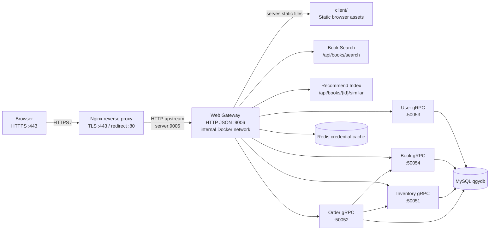

# TinyWebServer Bookstore

TinyWebServer is evolving into a C++17 bookstore backend. The project keeps the original epoll-based HTTP server and adds a business gateway, MySQL repositories, gRPC service boundaries, and a browser client for book browsing, search, carts, and orders.

## Architecture



## Repository Layout

| Path | Purpose |
|------|---------|
| `client/` | Static browser client for catalog search, account, cart, checkout, and orders. |
| `src/core/` | Server bootstrap, config, epoll loop, timer, and thread integration. |
| `src/net/http/` | HTTP parser, response model, router, URL params, and static file handling. |
| `src/app/controller/` | HTTP handlers for auth, books, inventory, orders, and recommendations. |
| `src/app/service/` | Business services that keep controllers thin. |
| `src/app/repository/` | Repository interfaces plus `memory/` test repositories and `mysql/` DAO implementations. |
| `src/app/client/` | Local and gRPC client abstractions used between services. |
| `src/app/grpc/` | gRPC service implementations and standalone service entrypoints. |
| `src/app/recommend/` | Lightweight book vector index for similar-book recommendations. |
| `proto/` | Protobuf contracts for user, book, inventory, and order services. |
| `scripts/init.sql` | MySQL schema and seed data. |
| `test/` | CTest-driven C++ tests. |

## Build And Test

Install dependencies on Ubuntu 20.04 / WSL2:

```bash
sudo apt-get update
sudo apt-get install -y cmake g++ libmysqlclient-dev libgrpc++-dev \
  libprotobuf-dev pkg-config protobuf-compiler protobuf-compiler-grpc
```

Redis login caching is optional at compile time. Enable it only when hiredis
and redis-plus-plus are installed:

```bash
cmake -S . -B build -DBUILD_TESTS=ON -DTINYWEBSERVER_ENABLE_REDIS=ON
```

The GitHub Actions Redis job builds redis-plus-plus from source; local Ubuntu
22.04 environments can also use `libhiredis-dev libredis-plus-plus-dev` when
available.

Build and run tests:

```bash
cmake -S . -B build -DBUILD_TESTS=ON
cmake --build build -j$(nproc)
cd build && ctest --output-on-failure
```

Validate generated RPC contracts and the Makefile path:

```bash
cmake --build build --target check_proto_contracts
make grpc-stubs
make server
```

## Run Locally

Start the full service chain with Docker Compose:

```bash
cd deploy/docker
docker compose up -d --build mysql redis user-service book-service inventory-service order-service server
```

Open `http://localhost:9006/index.html`.

For local binaries, initialize MySQL once and run from the repository root so static assets resolve correctly:

```bash
mysql -uroot -proot < scripts/init.sql
./build/server -p 9006
```

Set these variables when the gateway should call standalone gRPC services:

```bash
export USER_GRPC_TARGET=127.0.0.1:50053
export BOOK_GRPC_TARGET=127.0.0.1:50054
export INVENTORY_GRPC_TARGET=127.0.0.1:50051
export ORDER_GRPC_TARGET=127.0.0.1:50052
export REDIS_URL=tcp://127.0.0.1:6379
```

## HTTP API

Responses use `{"code":0,"message":"ok","data":...}`. See [docs/ecommerce_api.md](docs/ecommerce_api.md) for request and response details.

```text
GET  /api/health
GET  /api/live
GET  /api/ready
POST /api/auth/register
POST /api/auth/login
GET  /api/books
GET  /api/books/{book_id}
GET  /api/books/search?q=keyword
GET  /api/books/{book_id}/similar
POST /api/books
PATCH /api/books/{book_id}
GET  /api/inventory/books/{book_id}
POST /api/inventory/books/{book_id}/inbound
POST /api/orders
GET  /api/orders
GET  /api/orders/{order_id}
POST /api/orders/{order_id}/cancel
```

## CI

GitHub Actions runs on pushes and pull requests. The default job installs
C++/MySQL/gRPC/Protobuf dependencies, configures CMake with tests, builds all
targets, validates Protobuf contracts, runs CTest, checks gRPC stub generation,
and verifies the Makefile server build. A second job starts Redis, enables
`TINYWEBSERVER_ENABLE_REDIS=ON`, builds the Redis credential-cache path, and
runs the Redis-aware CTest suite.
