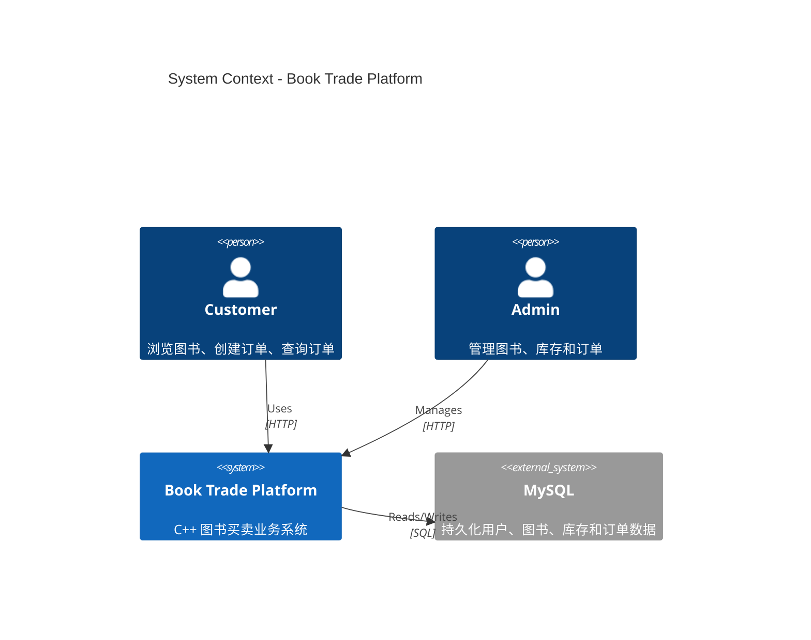
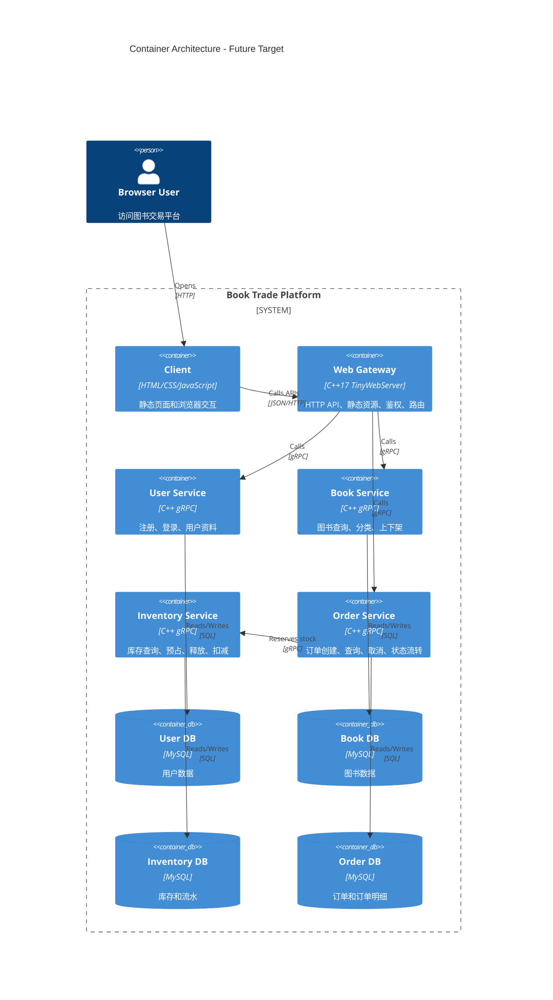
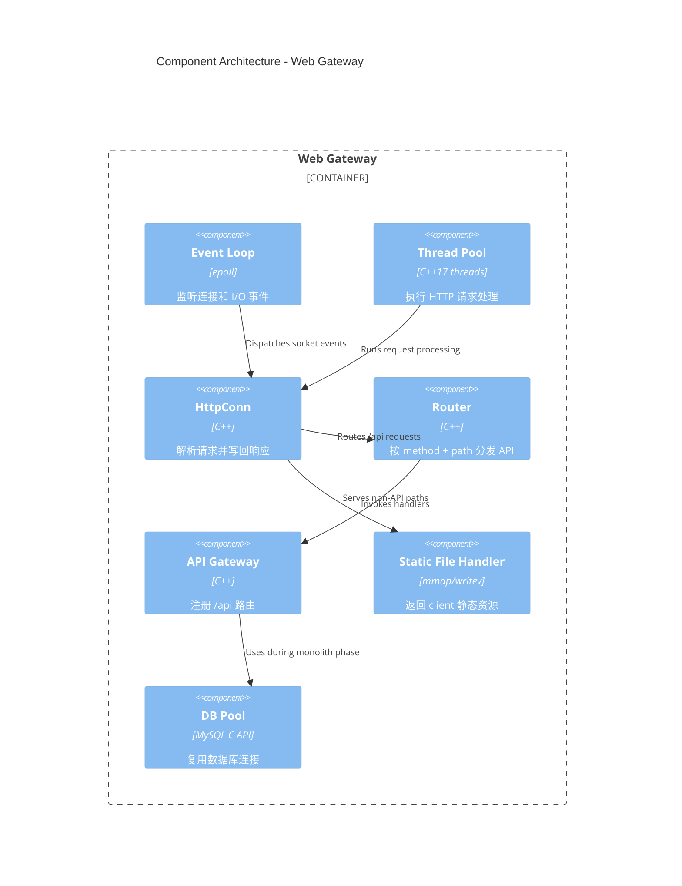
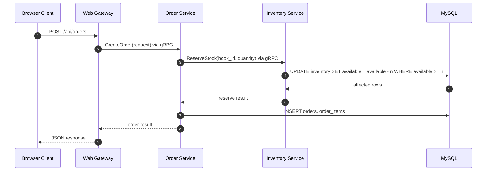

# TinyWebServer Book Trade Platform

本项目正在从教学型 TinyWebServer 演进为一个面向业务的 C++ 后端系统。当前阶段保留原有 epoll、线程池、定时器、日志、MySQL 连接池等基础能力，并将服务端逐步扩展为图书买卖平台的 HTTP API 网关。后续用户、书籍、库存、订单等业务服务会通过 gRPC 通信。

## 当前定位

- `client/`：浏览器端静态页面和资源。
- `server`：当前 C++ HTTP 服务端，负责静态资源、HTTP API、连接管理和请求分发。
- `src/net/http/`：HTTP 解析、响应构造和路由基础设施。
- `src/app/`：API 网关入口，包含 controller、service、repository 接口、内存仓储和 MySQL DAO。
- `proto/`：后续 gRPC 服务拆分使用的 Protobuf 契约。
- `scripts/init.sql`：本地 MySQL 初始化脚本，包含用户、图书、库存、订单和订单明细表。
- `docs/ecommerce_api.md`：HTTP API 约定和接口规划。

## 系统上下文



## 目标容器架构

浏览器只访问 `web-gateway`。后端服务之间使用 gRPC，避免让前端直接依赖 RPC 协议。



## 网关内部组件

Phase 1 的重点是先把 `HttpConn` 从业务逻辑中解耦出来。`HttpConn` 只负责连接级处理，业务请求进入 Router 和 API Gateway。



## 下单链路

库存服务是第一个适合拆成 gRPC 的服务，因为订单创建天然依赖库存预占。



## 演进路线

1. **Phase 0：目录边界整理**
   将 `static/` 迁移为 `client/`，明确浏览器端资源和服务端代码的边界。

2. **Phase 1：HTTP API 网关**
   建立 `HttpRequest`、`HttpResponse`、`Router`、`API Gateway`，先支持 `/api/health`，再迁移登录注册。

3. **Phase 2：模块化单体业务**
   在单进程内实现 `UserService`、`BookService`、`InventoryService`、`OrderService`，通过 repository 接口保留内存实现并接入 MySQL DAO。

4. **Phase 3：Protobuf 契约**
   新增 `proto/`，定义用户、图书、库存、订单服务接口，为 gRPC 拆分做准备。

5. **Phase 4：库存 gRPC 服务**
   优先拆出 `inventory-service`，订单创建通过 gRPC 预占库存，学习超时、错误码、幂等和调用日志。

6. **Phase 5：订单 gRPC 服务**
   拆出 `order-service`，形成 `gateway -> order-service -> inventory-service` 的服务调用链。

7. **Phase 6：用户和图书服务拆分**
   拆出 `user-service` 和 `book-service`，每个服务拥有自己的数据访问边界。

8. **Phase 7：工程化增强**
   引入配置文件、健康检查、trace id、gRPC interceptor、Docker Compose 多服务启动和基础压测。

## 当前可用命令

```bash
cmake -S . -B build -DBUILD_TESTS=ON
cmake --build build -j$(nproc)
cd build && ctest --output-on-failure
```

```bash
make server
./server -p 9006
```

```bash
make grpc-stubs
cmake --build build --target inventory_grpc_server
INVENTORY_DB_HOST=127.0.0.1 INVENTORY_DB_PORT=3306 INVENTORY_DB_USER=root INVENTORY_DB_PASSWORD=root INVENTORY_DB_NAME=qgydb \
./build/inventory_grpc_server 0.0.0.0:50051
INVENTORY_GRPC_TARGET=127.0.0.1:50051 ./server -p 9006
scripts/verify_inventory_grpc_e2e.sh
```

当前已实现的网关接口：

```text
GET /api/health
POST /api/auth/register
POST /api/auth/login
GET /api/books
GET /api/inventory/books/{book_id}
POST /api/orders
GET /api/orders
```
