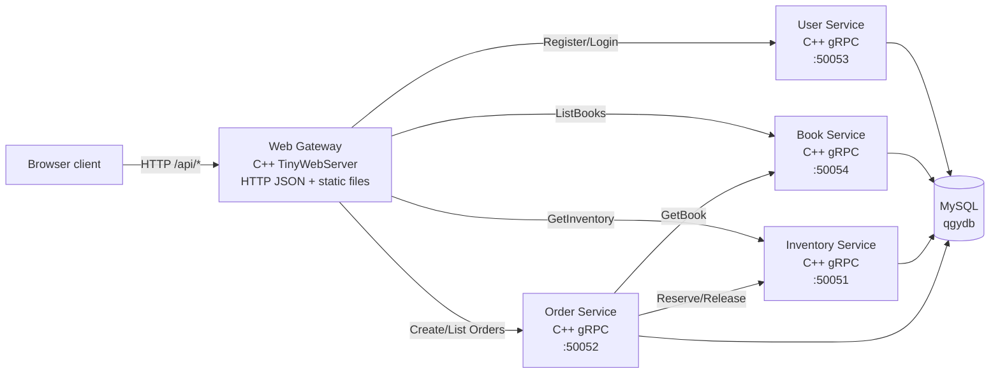

# TinyWebServer Book Trade Platform

TinyWebServer is being evolved from a teaching web server into a C++ business
backend for a simple book trading platform. The current architecture keeps the
epoll/thread-pool HTTP server as the gateway, while user, book, inventory, and
order capabilities are being split behind gRPC service boundaries.

## Current Architecture



## Repository Layout

- `client/`: static browser UI.
- `src/core/`: server bootstrap, epoll loop, thread pool integration.
- `src/net/http/`: HTTP request/response and router infrastructure.
- `src/app/controller/`: HTTP handlers for gateway routes.
- `src/app/client/`: local and gRPC client interfaces used between modules.
- `src/app/service/`: business logic for users, books, inventory, and orders.
- `src/app/repository/`: repository interfaces plus memory and MySQL DAO implementations.
- `src/app/grpc/`: gRPC service implementations and standalone service entrypoints.
- `proto/`: Protobuf contracts for backend-to-backend RPC.
- `test/`: assert-based C++ tests driven by CTest.

## Build And Test

```bash
cmake -S . -B build -DBUILD_TESTS=ON
cmake --build build -j$(nproc)
cd build && ctest --output-on-failure
```

Generate and validate Protobuf contracts:

```bash
make proto-check
make grpc-stubs
cmake --build build --target check_proto_contracts
```

Run the Docker Compose service chain:

```bash
cd deploy/docker
docker compose up -d --build mysql user-service book-service inventory-service order-service server
```

## Runtime Configuration

The gateway uses MySQL repositories by default after `WebServer::sql_pool()`.
Set these variables to route HTTP requests to remote gRPC services:

```bash
USER_GRPC_TARGET=127.0.0.1:50053
BOOK_GRPC_TARGET=127.0.0.1:50054
INVENTORY_GRPC_TARGET=127.0.0.1:50051
ORDER_GRPC_TARGET=127.0.0.1:50052
```

Service DB variables follow the same pattern: `USER_DB_HOST`, `BOOK_DB_HOST`,
`INVENTORY_DB_HOST`, `ORDER_DB_HOST`, plus `_PORT`, `_USER`, `_PASSWORD`,
`_NAME`, and `_POOL_SIZE`.

## Implemented HTTP APIs

```text
GET  /api/health
POST /api/auth/register
POST /api/auth/login
GET  /api/books
GET  /api/inventory/books/{book_id}
POST /api/orders
GET  /api/orders
```
